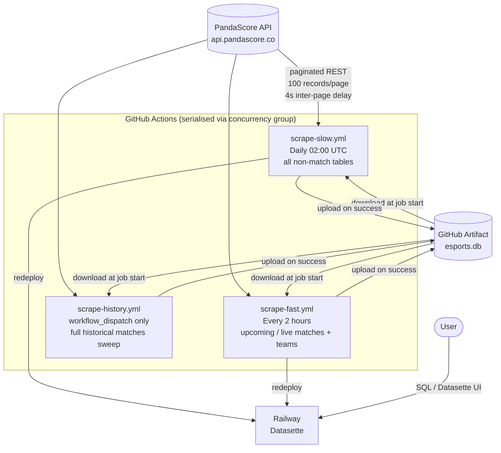
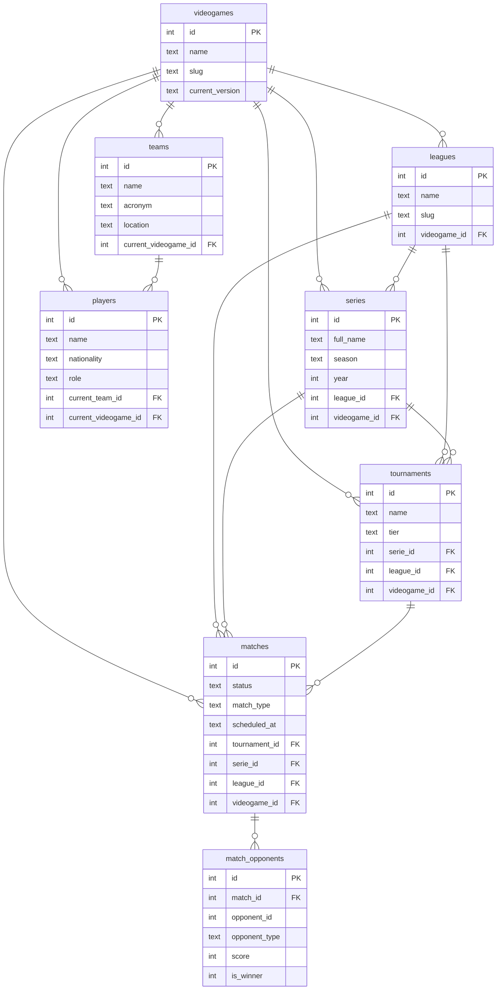

# esportsdb

[](https://github.com/ngshiheng/esportsdb/actions/workflows/scrape-fast.yml)
[](https://github.com/ngshiheng/esportsdb/actions/workflows/scrape-slow.yml)
[](https://github.com/ngshiheng/esportsdb/actions/workflows/scrape-history.yml)

A self-contained PandaScore scraper that builds and maintains a SQLite database of esports data (videogames, leagues, series, tournaments, matches, teams, players). The DB is persisted as a GitHub Actions artifact and kept fresh via a three-workflow CI pipeline.

## How it works



All three workflows share the **`esportsdb-artifact` concurrency group** (`cancel-in-progress: false`). This acts as a mutex — only one job holds the artifact lock at a time; others queue and wait.

## CI Workflows

| Workflow             | Schedule                 | Resources                                                            | Purpose                                                                               |
| -------------------- | ------------------------ | -------------------------------------------------------------------- | ------------------------------------------------------------------------------------- |
| `scrape-slow.yml`    | Daily 02:00 UTC          | `videogames`, `leagues`, `series`, `tournaments`, `teams`, `players` | Full daily rescrape of all non-match reference tables; Docker publish; Railway deploy |
| `scrape-fast.yml`    | Every 2 hours            | `*_upcoming`, `*_running`, `teams`                                   | Refresh upcoming/live matches and team data; Railway deploy                           |
| `scrape-history.yml` | `workflow_dispatch` only | `matches` (no filter)                                                | One-shot full historical matches backfill (~253K rows, ~2.5 h)                        |
| `test.yml`           | Every push / PR          | —                                                                    | Run unit tests                                                                        |

## Database Schema



All tables use `INSERT OR REPLACE` upserts. `PRAGMA foreign_keys=ON` and `PRAGMA journal_mode=WAL` are set on every connection.

## FK Dependency Order

Resources must be scraped in dependency order within a run, or the parent tables must already exist in the DB from a prior run.

```
videogames → leagues → series → tournaments → matches → match_opponents
                                            ↗
                       teams → players
```

Sub-resources (e.g. `matches_upcoming`) share the same FK dependencies as their parent resource. They use `skip_fk_errors=True` — orphaned rows are logged and skipped rather than crashing the run.

## Rate Limiting & Caching

| Setting          | Value                      | Notes                                                                                                                                                                                   |
| ---------------- | -------------------------- | --------------------------------------------------------------------------------------------------------------------------------------------------------------------------------------- |
| Inter-page delay | 5.0 s (3.0 s for backfill) | Keeps throughput ~720 req/hr vs 1,000/hr limit                                                                                                                                          |
| HTTP cache TTL   | None (no expiry)           | `hishel` SQLite-backed cache — entries persist until manually cleared; only HTTP 200 responses are stored (`_SuccessOnlyFilter`), so transient 5xx errors are never replayed from cache |
| Max retries      | 5                          | Exponential backoff on `httpx.RequestError`, HTTP 429, and HTTP 5xx                                                                                                                     |
| Backoff factor   | 2.0 s initial              | `tenacity` `wait_exponential`, min 2 s, max 60 s                                                                                                                                        |

## Secrets required

| Secret                   | Used by                                               |
| ------------------------ | ----------------------------------------------------- |
| `PANDASCORE_API_KEY`     | All scrape jobs                                       |
| `DOCKERHUB_TOKEN`        | `scrape-slow.yml` — Docker image publish              |
| `RAILWAY_TOKEN`          | `scrape-fast.yml`, `scrape-slow.yml` — Railway deploy |
| `RAILWAY_PROJECT_ID`     | `scrape-fast.yml`, `scrape-slow.yml` — Railway deploy |
| `RAILWAY_ENVIRONMENT_ID` | `scrape-fast.yml`, `scrape-slow.yml` — Railway deploy |
| `RAILWAY_SERVICE_ID`     | `scrape-fast.yml`, `scrape-slow.yml` — Railway deploy |
