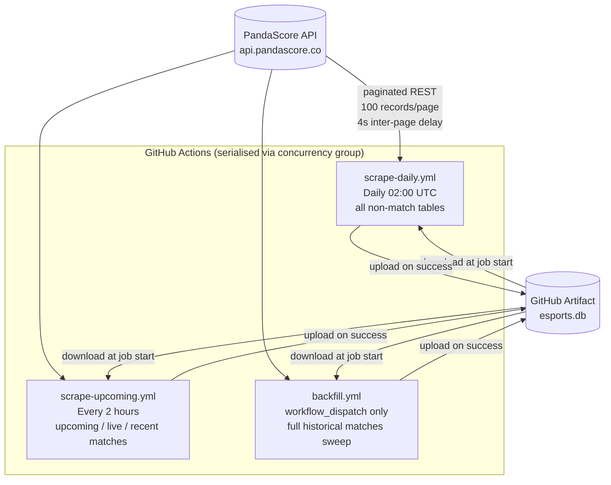
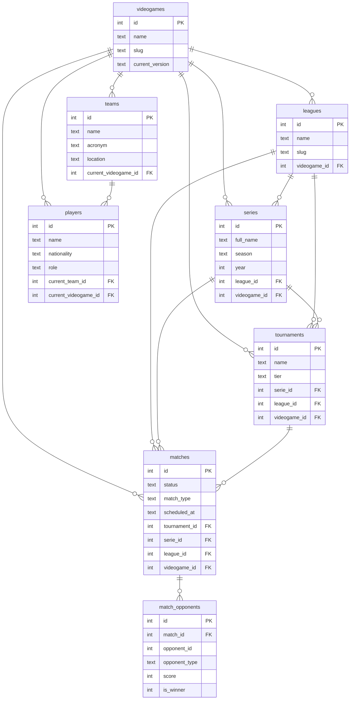

# esportsdb

A self-contained PandaScore scraper that builds and maintains a SQLite database of esports data (videogames, leagues, series, tournaments, matches, teams, players). The DB is persisted as a GitHub Actions artifact and kept fresh via a three-workflow CI pipeline.

## How it works



All three workflows share the **`esportsdb-artifact` concurrency group** (`cancel-in-progress: false`). This acts as a mutex — only one job holds the artifact lock at a time; others queue and wait.

## CI Workflows

| Workflow              | Schedule                 | Resources                                                            | Purpose                                                              |
| --------------------- | ------------------------ | -------------------------------------------------------------------- | -------------------------------------------------------------------- |
| `scrape-daily.yml`    | Daily 02:00 UTC          | `videogames`, `leagues`, `series`, `tournaments`, `teams`, `players` | Full daily rescrape of all non-match tables                          |
| `scrape-upcoming.yml` | Every 2 hours            | `*_upcoming`, `*_running`, `matches --since 48h`                     | Keep upcoming/live data fresh; catch recently finalised match scores |
| `backfill.yml`        | `workflow_dispatch` only | `matches` (no filter)                                                | One-shot full historical matches backfill (~253K rows, ~2.5 h)       |
| `test.yml`            | Every push / PR          | —                                                                    | Run unit tests                                                       |

### scrape-upcoming detail

Two sequential scrape steps per run:

1. **Upcoming & live** — `series_upcoming`, `series_running`, `tournaments_upcoming`, `tournaments_running`, `matches_upcoming`, `matches_running` (no `--since` filter — always fetches the full upcoming window)
2. **Recent past matches** — `matches --since 48h` (catches matches that just finished and need score/status written back)

## Database Schema



All tables use `INSERT OR REPLACE` upserts. `PRAGMA foreign_keys=ON` and `PRAGMA journal_mode=WAL` are set on every connection.

## FK Dependency Order

Resources must be scraped in dependency order within a run, or the parent tables must already exist in the DB from a prior run.

```
videogames → leagues → series → tournaments → matches → match_opponents
                                            ↗
                       teams → players
```

Sub-resources (e.g. `matches_upcoming`) share the same FK dependencies as their parent resource. They use `skip_fk_errors=True` — orphaned rows are logged and skipped rather than crashing the run.

## Rate Limiting & Caching

| Setting          | Value                      | Notes                                                           |
| ---------------- | -------------------------- | --------------------------------------------------------------- |
| Inter-page delay | 4.0 s (3.0 s for backfill) | Keeps throughput ~900 req/hr vs 1,000/hr limit                  |
| HTTP cache TTL   | 2 hours                    | `hishel` SQLite-backed cache — crash-safe to re-run immediately |
| Max retries      | 5                          | Exponential backoff on `httpx.RequestError` and HTTP 429        |
| Backoff factor   | 2.0 s initial              | `backoff.expo` with no jitter                                   |

## Backfill estimates (as of May 2026)

| Metric                           | Value      |
| -------------------------------- | ---------- |
| Total matches                    | ~253,333   |
| Pages at 100/page                | ~2,534     |
| Runtime (3 s delay + network)    | ~2.5 hours |
| Estimated DB size after backfill | ~178 MB    |
| GitHub artifact limit            | 2 GB       |

## Secrets required

| Secret               | Used by                                                       |
| -------------------- | ------------------------------------------------------------- |
| `PANDASCORE_API_KEY` | All scrape jobs                                               |
| `GH_PAT`             | Artifact download across workflow runs (needs `actions:read`) |

## Local usage

```bash
# Install uv (if needed)
brew install uv

# Run full scrape
PANDASCORE_API_KEY=sk-xxx uv run scrape.py scrape run

# Specific resources only
PANDASCORE_API_KEY=sk-xxx uv run scrape.py scrape run --resource leagues --resource teams --resource players

# Incremental matches (last 48 h)
PANDASCORE_API_KEY=sk-xxx uv run scrape.py scrape run --resource matches --since 48h

# Check total record counts without scraping (1 request per resource)
PANDASCORE_API_KEY=sk-xxx uv run scrape.py scrape run --resource matches --resource series --resource tournaments --count
```

### CLI flags

| Flag           | Default           | Description                                                                            |
| -------------- | ----------------- | -------------------------------------------------------------------------------------- |
| `--db`         | `data/esports.db` | SQLite database path                                                                   |
| `--resource`   | all resources     | Resource to scrape. Repeatable (`--resource a --resource b`)                           |
| `--since`      | `None`            | Lower-bound filter for matches (`48h`, `7d`, or ISO-8601). Ignored for other resources |
| `--page-size`  | `100`             | Records per API page                                                                   |
| `--page-delay` | `5.0`             | Seconds between paginated requests                                                     |
| `--count`      | `False`           | Print total record counts and exit (no scrape)                                         |

## Go-live order

1. Run `scrape-daily` once — populates `videogames`, `leagues`, `series`, `tournaments`, `teams`, `players`
2. Trigger `backfill` manually — full historical matches sweep (~2.5 h, holds the artifact lock; other jobs queue behind it automatically)
3. Enable scheduled runs — `scrape-upcoming` and `scrape-daily` maintain the DB from here on
